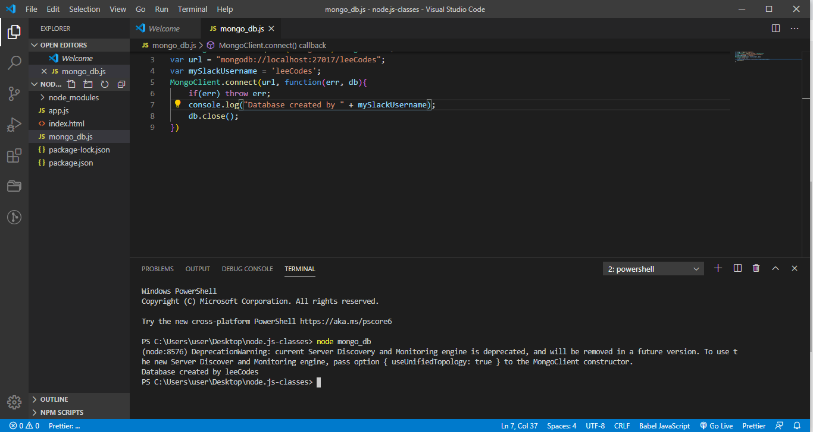

# Startng - Connecting to a database task

## screenshot for  mongo.exe and mongod.exe in my program files

## screenshot of my connection to my mongodb database

## screenshot of interns collection
! [interns collection](./img/interns_collection.PNG)